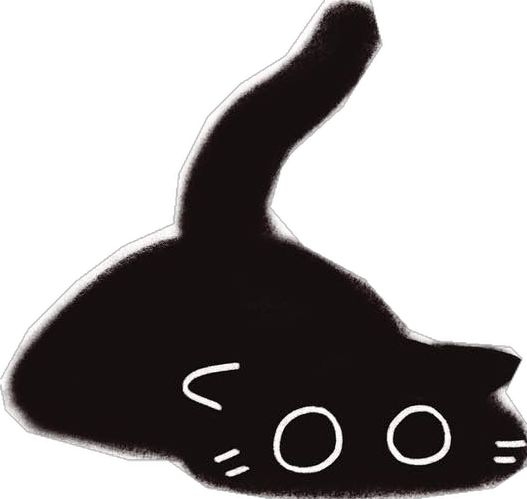
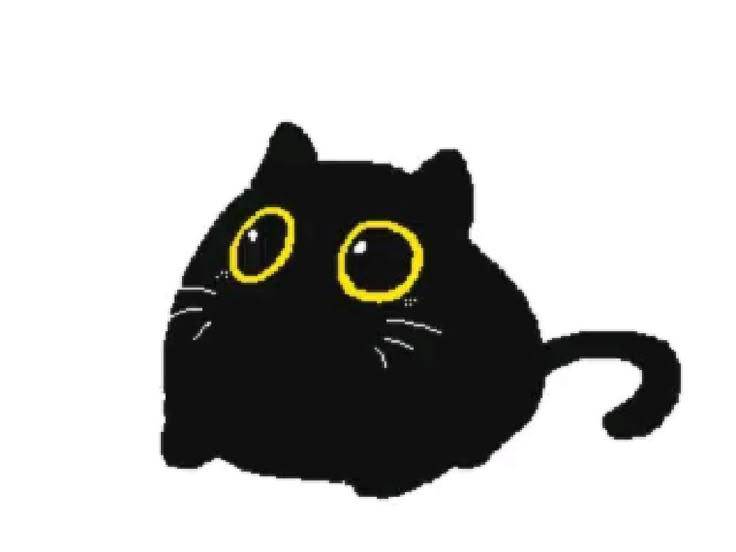

<!DOCTYPE html>
<html lang="en">
<head>
    <meta charset="UTF-8">
    <meta name="viewport" content="width=device-width, initial-scale=1.0">
    <title>Shine</title>
    
</head>
<body>
    <header>
        

            

            

                
Shine

                

            

        

        <nav aria-label="Main">
            <a href="#features">Cats</a>
            <a href="#examples">About me</a>
            <a href="#contact">contact me</a>
        </nav>
    </header>

    <main class="container">
        <section class="hero" aria-labelledby="hero-heading">
            

                <h1 id="hero-heading">Wellcome to my page</h1>
                

                

                   
                

                

                    

                        <h3>Cats</h3>
                         
                        
                        
                    

                    

                    <h3>Favorite song</h3>
                    <iframe data-testid="embed-iframe" style="border-radius:12px" src="https://open.spotify.com/embed/track/3xA3MGG3sVpZSsnHXvdYMn?utm_source=generator" width="100%" height="352" frameBorder="0" allowfullscreen="" allow="autoplay; clipboard-write; encrypted-media; fullscreen; picture-in-picture" loading="lazy"></iframe>
                    

                

            

        </section>
                    

                        <h3>About me</h3>
                        
I'm student from Charlottenlund vgs

                    

                    

                        <h3>Facts</h3>
                        
I have a cat, his name is Nikas

                    

                

            

        </section>

        

        <section id="contact" style="margin-top:28px">
            <h2 style="margin:0 0 12px 0">Contact me</h2>
            
        </section>

        <footer>
            © Made by Sofiia (snllix)
        </footer>
    </main>

    
</body>
</html>
